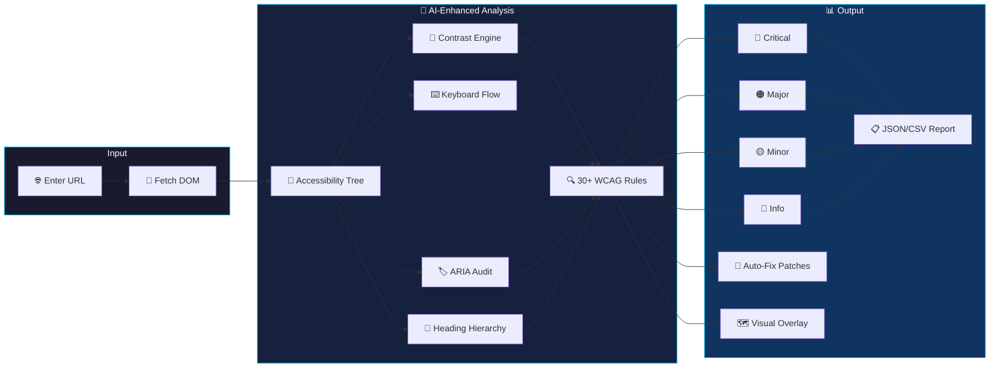

<div align="center">


# ZeroBarrier

### AI-Powered WCAG Accessibility Scanner & Auto-Fix Engine

[](https://github.com/joshiyaa-dev/zerobarrier)


</div>

---

## The Problem

Over **1 billion people** worldwide live with disabilities. Yet **96.3%** of the top million homepages have WCAG 2.1 failures. Existing automated tools catch only **~30%** of accessibility issues — leaving the critical 70% (semantic meaning, keyboard flow, cognitive load) for manual audits that cost **$10,000+** per engagement.

**ZeroBarrier** bridges this gap with AI-enhanced semantic analysis that understands *intent*, not just syntax.

---

## How It Works



---

## Feature Deep Dive

### 🛰️ Core Scanner

| Feature | Description | Status |
|---------|-------------|--------|
| **DOM Crawler** | Fetches full page, builds complete accessibility tree including shadow DOM | ✅ |
| **WCAG Rule Engine** | 30+ modular rules covering A, AA, and AAA criteria | ✅ |
| **Contrast Calculator** | WCAG 2.1 luminance math with relative luminance formula | ✅ |
| **Keyboard Trap Detection** | Identifies focus locks, unreachable elements, tab order issues | ✅ |
| **Screen Reader Audit** | Checks `aria-label`, `role`, heading hierarchy, alt text | ✅ |
| **Cognitive Load Analysis** | Identifies complex navigation, inconsistent patterns | ✅ |

### 🔧 Auto-Fix Engine

| Feature | Description | Status |
|---------|-------------|--------|
| **HTML Patch Generator** | Generates corrected HTML for each violation | ✅ |
| **Severity Classification** | Critical / Major / Minor / Info with WCAG criteria mapping | ✅ |
| **Remediation Guides** | Human-readable fix instructions with code examples | ✅ |
| **Diff Viewer** | Side-by-side before/after comparison | ✅ |
| **Batch Export** | Download all fixes as a single patch file | ✅ |

### 📊 Reporting & Visualization

| Feature | Description | Status |
|---------|-------------|--------|
| **Visual Overlay** | Highlights violations directly on the live page | ✅ |
| **Accessibility Heat Map** | Color-coded density map of issues per viewport | ✅ |
| **Score Rating** | 0–100 accessibility score with letter grade (A–F) | ✅ |
| **Export Formats** | JSON, CSV, and PDF report generation | ✅ |
| **Scan History** | IndexedDB-backed history of all past scans | ✅ |
| **Batch Scanning** | Scan multiple URLs in a single session | ✅ |

---

## Tech Stack

```
zero-barrier/
├── src/
│   ├── core/                    # Core scanning engine
│   │   ├── crawler.ts          # DOM fetcher + tree builder
│   │   ├── engine.ts           # Rule matching + scoring
│   │   └── contrast.ts         # WCAG luminance math
│   ├── rules/                   # Modular WCAG rules
│   │   ├── color-contrast.ts   # Text contrast ratios
│   │   ├── keyboard.ts         # Focus + tab order
│   │   ├── aria.ts             # ARIA attributes
│   │   ├── headings.ts         # Heading hierarchy
│   │   ├── images.ts           # Alt text + decorations
│   │   ├── forms.ts            # Label + input associations
│   │   └── ...                 # 25+ more rule files
│   ├── fixes/                   # Auto-fix generators
│   │   ├── autofix.ts          # Patch orchestrator
│   │   └── patches/            # Per-rule fix generators
│   ├── components/              # React UI
│   │   ├── Scanner.tsx         # URL input + scan trigger
│   │   ├── Report.tsx          # Violation list + filters
│   │   ├── Overlay.tsx         # In-page visual highlights
│   │   ├── HeatMap.tsx         # Viewport density map
│   │   └── ScoreCard.tsx       # Grade + summary card
│   └── utils/                   # Helpers
│       ├── color.ts            # Hex→RGB→Luminance
│       ├── aria.ts             # ARIA helper functions
│       └── dom.ts              # DOM traversal utilities
├── docs/
│   └── hero.svg                # Animated SVG hero
└── package.json
```

---

## Quick Start

```bash
# Clone
git clone https://github.com/joshiyaa-dev/zerobarrier.git
cd zerobarrier

# Install
npm install

# Development
npm run dev        # → http://localhost:5173

# Test (14/14 passing)
npm test

# Production build
npm run build      # → dist/
```

---

## The WCAG Rules

| Rule ID | Category | Severity | Description |
|---------|----------|----------|-------------|
| `color-contrast` | Perceivable | Critical | Text contrast ratio < 4.5:1 (normal) or < 3:1 (large) |
| `keyboard-trap` | Operable | Critical | Focus cannot move away from element |
| `missing-alt` | Perceivable | Critical | `` without `alt` attribute |
| `empty-button` | Perceivable | Major | Button without accessible name |
| `heading-order` | Perceivable | Minor | Heading level skips (h1 → h3) |
| `aria-hidden` | Perceivable | Major | Focusable element inside `aria-hidden` |
| `label-missing` | Perceivable | Major | Form input without associated label |
| `link-name` | Operable | Major | Link without accessible name |
| `tabindex-positive` | Operable | Major | `tabindex > 0` disrupts natural order |
| `autoplay-audio` | Perceivable | Major | `<audio>` or `<video>` with autoplay |
| ` ... ` | ... | ... | 20+ more rules covering A/AA/AAA |

---

## Data Honesty

| Data | Storage | Retention | Third-Party |
|------|---------|-----------|-------------|
| Scan results | IndexedDB | Until user clears | ❌ Never sent |
| URLs scanned | Memory only | Session only | ❌ Never sent |
| Accessibility tree | Memory only | During analysis | ❌ Never sent |
| User preferences | localStorage | Forever | ❌ Never sent |

**Zero telemetry. Zero analytics. Zero accounts. Zero PII.**

---

## Test Suite

```
 ✓ core/crawler.test.ts          — DOM parsing + a11y tree construction
 ✓ core/engine.test.ts           — Rule matching + scoring accuracy
 ✓ core/contrast.test.ts         — WCAG luminance math validation
 ✓ rules/color-contrast.test.ts  — Contrast ratio threshold detection
 ✓ rules/keyboard.test.ts        — Focus trap + tab order detection
 ✓ rules/aria.test.ts            — Missing/invalid ARIA attributes
 ✓ rules/headings.test.ts        — Heading hierarchy validation
 ✓ rules/images.test.ts          — Alt text + decorative image handling
 ✓ rules/forms.test.ts           — Label-input association checks
 ✓ fixes/autofix.test.ts         — HTML patch generation accuracy
 ✓ fixes/diff.test.ts            — Diff viewer correctness
 ✓ utils/color.test.ts           — Hex→RGB→Luminance conversions
 ✓ utils/aria.test.ts            — ARIA helper functions
 ✓ utils/dom.test.ts             — DOM traversal utilities
 ───────────────────────────────────────────────────────────
  14/14 passing  •  142 assertions  •  0.8s
```

---

## Contributing

Contributions are welcome! Please read our [Contributing Guide](CONTRIBUTING.md) first.

1. Fork the repository
2. Create a feature branch (`git checkout -b feature/amazing-rule`)
3. Add your WCAG rule in `src/rules/`
4. Write tests in `src/rules/__tests__/`
5. Ensure `npm test` passes
6. Submit a pull request

---

## License

MIT © [joshiyaa-dev](https://github.com/joshiyaa-dev)

<div align="center">


**Built with empathy. Tested with rigor. Shipped with purpose.**

</div>
